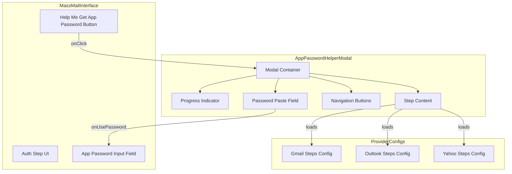

# Design Document: App Password Helper

## Overview

The App Password Helper feature introduces an interactive modal component that guides users through the process of obtaining app-specific passwords from their email providers (Gmail, Outlook, Yahoo). The modal provides a step-by-step wizard experience with progress tracking, external links, and the ability to auto-fill the password field in the parent form.

This is a frontend-only feature that enhances the existing MassMailInterface component by adding a reusable modal component with provider-specific configuration.

## Architecture



### Component Hierarchy

1. **MassMailInterface** (existing) - Parent component that manages email credentials
2. **AppPasswordHelperModal** (new) - Modal component with wizard functionality
3. **ProviderStepConfig** (new) - Configuration objects defining steps per provider

## Components and Interfaces

### AppPasswordHelperModal Component

```typescript
interface AppPasswordHelperModalProps {
  isOpen: boolean;
  onClose: () => void;
  provider: 'gmail' | 'outlook' | 'yahoo';
  onPasswordSubmit: (password: string) => void;
}

interface ProviderStep {
  id: number;
  title: string;
  description: string;
  externalLink?: {
    url: string;
    label: string;
  };
  tip?: string;
}

interface ProviderConfig {
  provider: 'gmail' | 'outlook' | 'yahoo';
  title: string;
  steps: ProviderStep[];
  note?: string;
}
```

### Modal State Management

```typescript
interface ModalState {
  currentStep: number;
  completedSteps: Set<number>;
  pastedPassword: string;
}
```

### Provider Configurations

Each provider has a configuration object defining:
- Provider name and display title
- Array of steps with titles, descriptions, and optional external links
- Optional notes (e.g., Outlook's "regular password may work" note)

## Data Models

### Gmail Configuration

```typescript
const gmailConfig: ProviderConfig = {
  provider: 'gmail',
  title: 'Get Gmail App Password',
  steps: [
    {
      id: 1,
      title: 'Open Google Account Security',
      description: 'Click the button below to open your Google Account security settings in a new tab.',
      externalLink: {
        url: 'https://myaccount.google.com/security',
        label: 'Open Google Security'
      }
    },
    {
      id: 2,
      title: 'Enable 2-Step Verification',
      description: 'If not already enabled, click on "2-Step Verification" and follow the prompts to set it up.',
      tip: 'You\'ll need your phone to complete this step.'
    },
    {
      id: 3,
      title: 'Go to App Passwords',
      description: 'Click the button below to go directly to the App Passwords page.',
      externalLink: {
        url: 'https://myaccount.google.com/apppasswords',
        label: 'Open App Passwords'
      }
    },
    {
      id: 4,
      title: 'Generate App Password',
      description: 'Select "Mail" as the app and your device type, then click "Generate".'
    },
    {
      id: 5,
      title: 'Copy & Paste Password',
      description: 'Copy the 16-character password shown and paste it below.'
    }
  ]
};
```

### Outlook Configuration

```typescript
const outlookConfig: ProviderConfig = {
  provider: 'outlook',
  title: 'Get Outlook App Password',
  note: 'Outlook may work with your regular password, but an app password is recommended for security.',
  steps: [
    {
      id: 1,
      title: 'Open Microsoft Security Settings',
      description: 'Click the button below to open your Microsoft account security settings.',
      externalLink: {
        url: 'https://account.live.com/proofs/manage/additional',
        label: 'Open Microsoft Security'
      }
    },
    {
      id: 2,
      title: 'Create App Password',
      description: 'Look for "App passwords" section and click "Create a new app password".'
    },
    {
      id: 3,
      title: 'Copy & Paste Password',
      description: 'Copy the generated password and paste it below.'
    }
  ]
};
```

### Yahoo Configuration

```typescript
const yahooConfig: ProviderConfig = {
  provider: 'yahoo',
  title: 'Get Yahoo App Password',
  steps: [
    {
      id: 1,
      title: 'Open Yahoo Account Security',
      description: 'Click the button below to open your Yahoo account security settings.',
      externalLink: {
        url: 'https://login.yahoo.com/account/security',
        label: 'Open Yahoo Security'
      }
    },
    {
      id: 2,
      title: 'Generate App Password',
      description: 'Scroll to "App passwords" and click "Generate app password". Select "Other App" and name it.'
    },
    {
      id: 3,
      title: 'Copy & Paste Password',
      description: 'Copy the generated password and paste it below.'
    }
  ]
};
```


## Correctness Properties

*A property is a characteristic or behavior that should hold true across all valid executions of a system-essentially, a formal statement about what the system should do. Properties serve as the bridge between human-readable specifications and machine-verifiable correctness guarantees.*

### Property 1: Provider-specific modal opening
*For any* email provider (gmail, outlook, yahoo), when the help button is clicked, the modal SHALL open with that provider's configuration loaded, displaying the correct title and steps for that provider.
**Validates: Requirements 1.1, 2.1, 3.1**

### Property 2: External link rendering
*For any* step in any provider configuration that contains an externalLink property, the modal SHALL render a button with the correct URL that opens in a new browser tab (target="_blank").
**Validates: Requirements 1.3, 2.2, 3.2**

### Property 3: Step completion state machine
*For any* step in the wizard, when marked as complete, the step SHALL be added to the completedSteps set, the currentStep SHALL increment (if not on final step), and the progress indicator SHALL reflect the updated state.
**Validates: Requirements 1.4, 5.2**

### Property 4: Final step password submission
*For any* valid password string entered on the final step, clicking "Use This Password" SHALL call onPasswordSubmit with that exact password value and close the modal.
**Validates: Requirements 1.5**

### Property 5: Modal dismissal
*For any* open modal state, the modal SHALL close when: (a) the close button is clicked, (b) the backdrop is clicked, or (c) the Escape key is pressed. In all cases, onClose SHALL be called exactly once.
**Validates: Requirements 4.1, 4.2, 4.3**

### Property 6: Credential preservation on close
*For any* credentials entered in the parent form before opening the modal, closing the modal SHALL NOT modify those credential values.
**Validates: Requirements 4.4**

### Property 7: Progress indicator accuracy
*For any* modal state with currentStep and totalSteps, the progress indicator SHALL display the correct fraction (currentStep/totalSteps) and visually highlight the current step.
**Validates: Requirements 5.1, 5.3**

## Error Handling

### User Errors
- **Empty password submission**: If user clicks "Use This Password" with empty input, show inline validation error and prevent submission
- **Invalid password format**: For Gmail (16 chars), validate format before submission and show helpful error message

### Edge Cases
- **Modal opened with invalid provider**: Default to Gmail configuration
- **Step navigation beyond bounds**: Clamp currentStep to valid range [1, totalSteps]
- **Rapid clicking**: Debounce step completion to prevent double-advances

## Testing Strategy

### Property-Based Testing Library
Use **fast-check** for property-based testing in TypeScript/React.

### Unit Tests
- Render tests for each provider configuration
- Event handler tests for button clicks
- Keyboard event tests for Escape key handling

### Property-Based Tests
Each correctness property will be implemented as a property-based test:

1. **Property 1 Test**: Generate random provider values, verify modal renders correct config
2. **Property 2 Test**: Generate provider configs with varying externalLink presence, verify button rendering
3. **Property 3 Test**: Generate sequences of step completions, verify state transitions
4. **Property 4 Test**: Generate random password strings, verify onPasswordSubmit receives exact value
5. **Property 5 Test**: Generate random dismissal actions, verify onClose is called
6. **Property 6 Test**: Generate random credential states, verify preservation after modal close
7. **Property 7 Test**: Generate random step/total combinations, verify progress display

### Test Configuration
- Minimum 100 iterations per property test
- Each test tagged with format: `**Feature: app-password-helper, Property {number}: {property_text}**`

### Integration Tests
- Full flow test: Open modal → complete steps → submit password → verify form filled
- Provider switching test: Open Gmail modal, close, open Outlook modal, verify correct content
